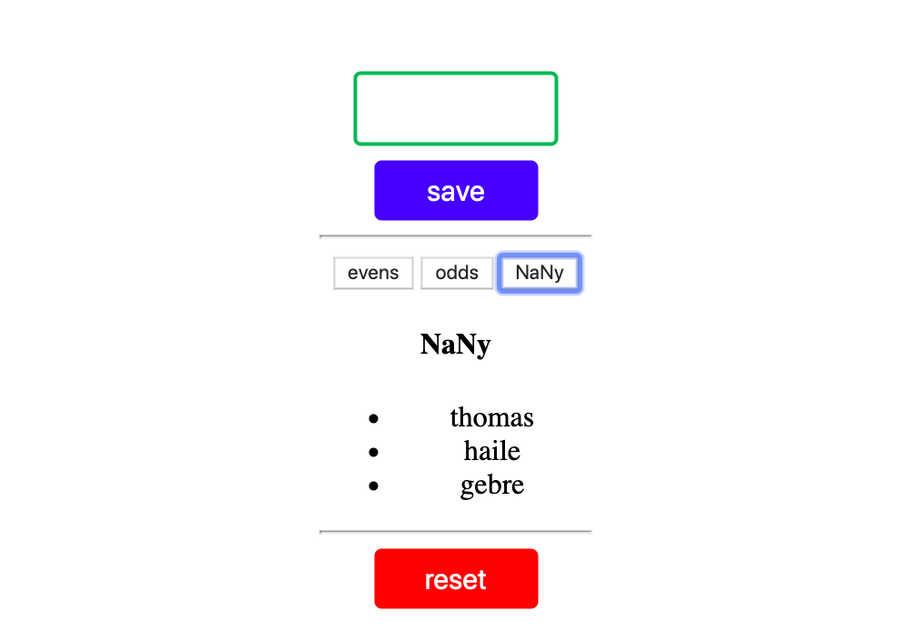

# Even or Odd

---
The objective of this project/product is working with even and odd numbers to keep practice working on handlers, listeners, dom elements and render views. simply created with html, css and js for learning purpose.

# Technologies
---

I used to develop this project:

* Html
* CSS
* Javascript

# project status
---

Since this project is for learning purpose it is finished.

# Contributing

pull requests are welcome. for major changes, please open an issue first to discuss what would like to change.

> Don't forget to rewrite this README to describe your project :) 
Check out these articles to learn more about writing a good README: 
[makeareadme.com](https://www.makeareadme.com/), [bulldogjob](https://bulldogjob.com/news/449-how-to-write-a-good-readme-for-your-github-project), [meakaakka](https://medium.com/@meakaakka/a-beginners-guide-to-writing-a-kickass-readme-7ac01da88ab3)
